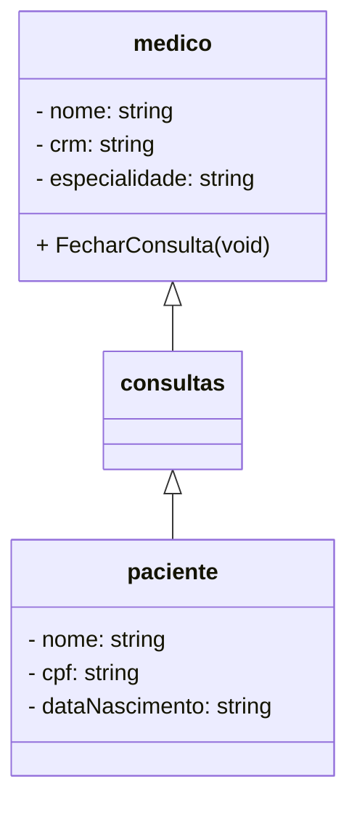

# Aps1-modelagem-software

# Sumário

1. [Diagrama de Atividades](#diagrama-de-atividades)

# Diagrama de Atividades

```mermaid
classDiagram
    medico <|-- consultas
    consultas <|-- paciente
    class medico {
        - nome: string
        - crm: string
        - especialidade: string
        + FecharConsulta (void)
    }

    class paciente {
        - nome: string
        - cpf: string
        - dataNascimento: string

    }

    class consultas {
        
    }


```